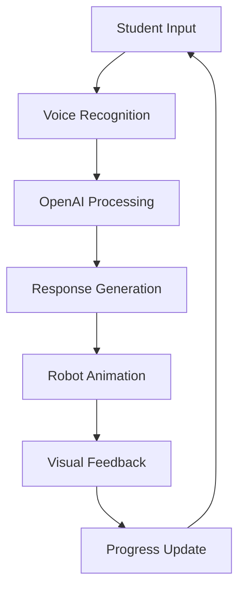

# 🤖 Arabic Letter Learning Robot

<div align="center">


**Interactive AI-powered English letter learning robot for children with Arabic voice interaction**

[](https://opensource.org/licenses/MIT)
[](http://makeapullrequest.com)
[](https://github.com/Ibrahem-Khaled/smart-letter-guide/issues)

</div>

---

## 📖 Table of Contents

- [✨ Features](#-features)
- [🎯 Demo](#-demo)
- [🚀 Quick Start](#-quick-start)
- [🛠️ Installation](#️-installation)
- [📱 Usage](#-usage)
- [🏗️ Architecture](#️-architecture)
- [🔧 Configuration](#-configuration)
- [🎮 Educational Content](#-educational-content)
- [🤝 Contributing](#-contributing)
- [📄 License](#-license)
- [💬 Support](#-support)

---

## ✨ Features

### 🤖 **Intelligent Robot Companion**
- **3D Animated Robot** with realistic movements and expressions
- **Arabic Voice Interaction** with natural speech patterns
- **Real-time Speech Recognition** for student responses
- **Adaptive Learning** based on student progress

### 📚 **Comprehensive Learning System**
- **11 Structured Learning Steps** from introduction to assessment
- **Letter Recognition** for both uppercase and lowercase
- **Interactive Writing Practice** with guided tracing
- **Vocabulary Building** with visual word associations
- **Pronunciation Training** with audio feedback

### 🎮 **Interactive Elements**
- **Interactive Blackboard** for letter writing practice
- **Educational Games** (Balloons Game & Multiple Choice)
- **Image Selection Quizzes** for reinforcement
- **Progress Tracking** with visual indicators
- **Encouraging Feedback** system

### 🎵 **Multimedia Content**
- **Letter Sounds** with high-quality audio
- **Educational Songs** via YouTube integration
- **Visual Word Cards** with Arabic translations
- **Custom Image Upload** for personalized content
- **Audio Recording** for pronunciation practice

### 🎨 **Modern UI/UX**
- **Glass Morphism Design** with beautiful animations
- **Responsive Layout** for all screen sizes
- **Particle Effects** for engaging visuals
- **Progress Indicators** for lesson tracking
- **Intuitive Controls** for easy navigation

---

## 🎯 Demo

<div align="center">

### 🖼️ Screenshots

| Main Interface | Robot Interaction | Writing Practice |
|:--------------:|:-----------------:|:----------------:|
|  |  |  |

| Educational Games | Progress Tracking | Settings Panel |
|:-----------------:|:-----------------:|:---------------:|
|  |  |  |

</div>

### 🎥 Live Demo

[](https://your-demo-url.com)

---

## 🚀 Quick Start

Get up and running in under 5 minutes!

```bash
# Clone the repository
git clone https://github.com/Ibrahem-Khaled/smart-letter-guide.git
cd smart-letter-guide

# Install dependencies
npm install

# Set up environment variables
cp .env.example .env
# Edit .env with your OpenAI API key

# Start the development server
npm run dev

# Open http://localhost:5173 in your browser
```

---

## 🛠️ Installation

### Prerequisites

- **Node.js** 18.0 or higher
- **npm** 9.0 or higher
- **OpenAI API Key** (for voice interaction)

### Step-by-Step Installation

1. **Clone the Repository**
```bash

   git clone https://github.com/Ibrahem-Khaled/smart-letter-guide.git
   cd smart-letter-guide
```


2. **Install Dependencies**
```bash
npm install
```


3. **Environment Setup**
```bash

   cp .env.example .env
   ```
   
   Edit `.env` file:
   ```env
   OPENAI_API_KEY=your_openai_api_key_here
   ```

4. **Start Development Server**
```bash
npm run dev
```


5. **Access the Application**
   Open [http://localhost:5173](http://localhost:5173) in your browser

### Production Build

```bash
# Build for production
npm run build

# Preview production build
npm run preview
```

---

## 📱 Usage

### 🎓 **For Educators**

1. **Setup Lesson Content**
   - Upload custom letter images
   - Record letter pronunciations
   - Add educational songs
   - Configure word associations

2. **Start a Lesson**
   - Select target letter (A, B, C)
   - Connect to voice system
   - Begin interactive lesson

3. **Monitor Progress**
   - Track student responses
   - View completion status
   - Adjust difficulty as needed

### 👶 **For Students**

1. **Interactive Learning**
   - Listen to robot instructions
   - Practice letter pronunciation
   - Trace letters on blackboard
   - Play educational games

2. **Progress Tracking**
   - Visual progress indicators
   - Completion celebrations
   - Encouraging feedback

### 🎮 **Game Modes**

- **Balloons Game**: Pop balloons containing target letters
- **Multiple Choice**: Select correct answers from options
- **Image Selection**: Choose images that start with target letter

---

## 🏗️ Architecture

### 📁 Project Structure

```
smart-letter-guide/
├── 📁 src/
│   ├── 📁 components/          # React components
│   │   ├── 🤖 Robot3D.tsx     # 3D robot component
│   │   ├── 📝 Blackboard.tsx   # Interactive writing board
│   │   ├── 🎈 BalloonsGame.tsx # Educational games
│   │   └── 📸 ImageUpload.tsx  # Media upload components
│   ├── 📁 lib/                 # Utility functions
│   ├── 🎯 App.tsx              # Main application
│   ├── 🗣️ voiceSdkClient.ts   # OpenAI integration
│   └── 📚 letters.ts           # Educational content
├── 📁 public/                  # Static assets
├── 📁 server/                  # Backend server
└── 📄 package.json             # Dependencies
```

### 🔧 Technology Stack

| Category | Technology | Purpose |
|:--------:|:----------:|:--------|
| **Frontend** | React 19.1.1 | UI framework |
| **Language** | TypeScript 5.8.3 | Type safety |
| **Build Tool** | Vite 7.1.6 | Development server |
| **3D Graphics** | Three.js 0.180.0 | 3D robot rendering |
| **AI/Voice** | OpenAI Realtime API | Voice interaction |
| **Styling** | Tailwind CSS 4.1.13 | Utility-first CSS |
| **Backend** | Express.js 5.1.0 | API server |

### 🔄 Data Flow



---

## 🔧 Configuration

### 🎛️ **Environment Variables**

| Variable | Description | Required |
|:--------:|:------------|:--------:|
| `OPENAI_API_KEY` | OpenAI API key for voice interaction | ✅ |
| `PORT` | Server port (default: 3000) | ❌ |
| `NODE_ENV` | Environment mode (development/production) | ❌ |

### ⚙️ **Customization Options**

1. **Letter Content**
```typescript

   // Add new letters in src/letters.ts
   'D': {
     letter: 'D',
     capital: 'D',
     small: 'd',
     sound: '/sounds/letter-d.mp3',
  words: [

       { word: 'Dog', arabic: 'كلب', image: '/images/dog.jpg' }
     ]
   }
   ```

2. **Robot Messages**
   ```typescript
   // Customize robot responses
   const ROBOT_MESSAGES = {
     greeting: 'مرحباً! أنا روبوت تعليم الحروف',
     encouragement: 'أحسنت! استمر في المحاولة'
   }
   ```

3. **Visual Themes**
   ```css
   /* Customize colors in src/index.css */
   :root {
     --primary-color: #your-color;
     --secondary-color: #your-color;
   }
   ```

---

## 🎮 Educational Content

### 📚 **Learning Methodology**

The system follows a structured 11-step learning process:

1. **Introduction** - Welcome and letter introduction
2. **Letter Recognition** - Visual identification
3. **Sound Practice** - Pronunciation training
4. **Letter Testing** - Knowledge assessment
5. **Case Comparison** - Uppercase vs lowercase
6. **Writing Practice** - Interactive tracing
7. **Post-Writing Quiz** - Reinforcement
8. **Vocabulary Building** - Word associations
9. **Final Assessment** - Comprehensive testing
10. **Educational Song** - Musical reinforcement
11. **Lesson Conclusion** - Summary and games

### 🎯 **Learning Objectives**

- **Letter Recognition**: Identify letters visually
- **Pronunciation**: Correct letter sounds
- **Writing Skills**: Proper letter formation
- **Vocabulary**: Word associations
- **Engagement**: Interactive learning experience

### 📊 **Progress Tracking**

- Visual progress indicators
- Completion percentages
- Response accuracy metrics
- Time spent per lesson
- Difficulty adjustments

---

## 🤝 Contributing

We welcome contributions! Here's how you can help:

### 🐛 **Reporting Issues**

1. Check existing [issues](https://github.com/your-username/arabic-letter-learning-robot/issues)
2. Create a new issue with:
   - Clear description
   - Steps to reproduce
   - Expected vs actual behavior
   - Screenshots (if applicable)

### 💡 **Feature Requests**

1. Check existing [feature requests](https://github.com/your-username/arabic-letter-learning-robot/issues?q=is%3Aissue+is%3Aopen+label%3Aenhancement)
2. Create a new issue with:
   - Feature description
   - Use case scenario
   - Proposed implementation
   - Benefits to users

### 🔧 **Code Contributions**

1. **Fork the Repository**
   ```bash
   git clone https://github.com/Ibrahem-Khaled/smart-letter-guide.git
   cd smart-letter-guide
   ```

2. **Create Feature Branch**
   ```bash
   git checkout -b feature/your-feature-name
   ```

3. **Make Changes**
   - Follow coding standards
   - Add tests for new features
   - Update documentation

4. **Test Your Changes**
   ```bash
   npm run lint
   npm run build
   npm run preview
   ```

5. **Submit Pull Request**
   - Clear description of changes
   - Reference related issues
   - Include screenshots (if applicable)

### 📋 **Development Guidelines**

- **Code Style**: Follow ESLint configuration
- **Commit Messages**: Use conventional commits
- **Testing**: Add tests for new features
- **Documentation**: Update README for new features
- **Performance**: Optimize for mobile devices

### 🏷️ **Issue Labels**

| Label | Description |
|:-----:|:------------|
| `bug` | Something isn't working |
| `enhancement` | New feature or request |
| `documentation` | Improvements to documentation |
| `good first issue` | Good for newcomers |
| `help wanted` | Extra attention is needed |

---

## 📄 License

This project is licensed under the **MIT License** - see the [LICENSE](LICENSE) file for details.

### 📜 **License Summary**

- ✅ Commercial use
- ✅ Modification
- ✅ Distribution
- ✅ Private use
- ❌ Liability
- ❌ Warranty

---

## 💬 Support

### 🆘 **Getting Help**

- **Documentation**: Check this README and code comments
- **Issues**: Search [existing issues](https://github.com/Ibrahem-Khaled/smart-letter-guide/issues)
- **Discussions**: Join [GitHub Discussions](https://github.com/Ibrahem-Khaled/smart-letter-guide/discussions)
- **Email**: Contact us at [your-email@example.com](mailto:your-email@example.com)

### 🔗 **Useful Links**

- [OpenAI API Documentation](https://platform.openai.com/docs)
- [React Documentation](https://react.dev/)
- [Three.js Documentation](https://threejs.org/docs/)
- [Tailwind CSS Documentation](https://tailwindcss.com/docs)

### 🌟 **Show Your Support**

If this project helped you, please give it a ⭐️ star!

---

<div align="center">

**Made with ❤️ for Arabic children's education**

[](https://github.com/Ibrahem-Khaled/smart-letter-guide/stargazers)
[](https://github.com/Ibrahem-Khaled/smart-letter-guide/network)
[](https://github.com/Ibrahem-Khaled/smart-letter-guide/watchers)

</div>